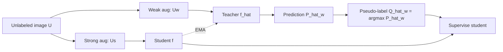

# Giải thích ngắn Section 3.1 - Problem Formulation and Preliminary

Tài liệu này giải thích ngắn gọn Section 3.1 của bài báo `2503.16997v1.pdf`. Mục tiêu của mục 3.1 là đặt nền tảng bài toán và mô tả quy trình huấn luyện cơ bản trước khi tác giả giới thiệu SynFoC.

## 1. Bài toán đang xét là gì?

Bài báo xét bài toán **Mixed Domain Semi-Supervised Medical Image Segmentation** (MiDSS).

Nói một cách đơn giản:

- Ta có **rất ít ảnh có nhãn**.
- Ta có **nhiều ảnh không có nhãn**.
- Ảnh có nhãn chỉ đến từ **một domain / một trung tâm dữ liệu**.
- Ảnh không có nhãn đến từ **nhiều domain khác nhau**.

Ví dụ trong ảnh y tế, các domain có thể khác nhau do máy chụp, bệnh viện, nhóm bệnh nhân, giao thức chụp, hoặc mức độ bệnh.

## 2. Ký hiệu chính

| Ký hiệu | Ý nghĩa |
|---|---|
| `L = {(Xi, Yi)}_{i=1}^N` | Tập dữ liệu có nhãn |
| `U = {Ui}_{i=1}^M` | Tập dữ liệu không có nhãn |
| `N`, `M` | Số mẫu có nhãn và không có nhãn, với `M >= N` |
| `Xi`, `Ui` | Ảnh đầu vào, kích thước `W x H x L` |
| `Yi` | Ground truth mask của ảnh `Xi` |
| `C` | Số lớp semantic, trong đó lớp `0` là background |
| `D = {Di}_{i=1}^K` | Tập `K` domain / trung tâm dữ liệu |
| `Dj` | Domain duy nhất sinh ra dữ liệu có nhãn |

Điểm quan trọng: **dữ liệu có nhãn không đại diện cho tất cả domain**. Đây là lý do mô hình dễ bị overfit vào domain có nhãn và khó tổng quát sang dữ liệu không có nhãn.

## 3. Khung Mean Teacher

Section 3.1 dùng một khung quen thuộc trong semi-supervised learning: **Mean Teacher**.

Có hai mô hình cùng kiến trúc:

- `f`: student model, được cập nhật trực tiếp bằng gradient.
- `f_hat`: teacher model, được cập nhật bằng EMA từ student.

EMA có thể hiểu là teacher là bản trung bình ổn định hơn của student qua thời gian. Teacher thường tạo pseudo-label đáng tin cậy hơn student tại một bước huấn luyện cụ thể.



## 4. Weak và strong augmentation

Với ảnh không có nhãn `U`, tác giả tạo hai phiên bản:

- `Uw`: weak augmentation, biến đổi nhẹ.
- `Us`: strong augmentation, biến đổi mạnh hơn.

Teacher dự đoán trên `Uw` để tạo pseudo-label. Student học trên mẫu khó hơn, liên quan đến `Us`. Trực giác là: nếu mô hình học được cách nhận ra cùng một đối tượng qua biến đổi mạnh, biểu diễn của nó sẽ bền vững hơn.

## 5. Tạo intermediate sample bằng Copy-Paste

Tác giả không chỉ dùng trực tiếp `Us`. Họ tạo thêm một mẫu trung gian `Uc` bằng cách copy một vùng từ ảnh có nhãn `Xw` và paste lên ảnh không có nhãn đã biến đổi mạnh `Us`.

Công thức:

```text
Uc = Xw * M + Us * (1 - M)
Q_hat_c = Yw * M + Q_hat_w * (1 - M)
```

Trong đó:

| Ký hiệu | Ý nghĩa |
|---|---|
| `Xw` | Ảnh có nhãn sau weak augmentation |
| `Yw` | Mask ground truth tương ứng với `Xw` |
| `Us` | Ảnh không có nhãn sau strong augmentation |
| `Q_hat_w` | Pseudo-label teacher tạo cho ảnh không có nhãn |
| `M` | Mặt nạ nhị phân cho vùng copy-paste |
| `1 - M` | Phần còn lại ngoài vùng copy-paste |
| `Uc` | Ảnh trung gian sau khi trộn `Xw` và `Us` |
| `Q_hat_c` | Nhãn của `Uc`, ghép từ ground truth và pseudo-label |

## 6. Trực giác của công thức Copy-Paste

Hãy xem `M` như một cái khuôn chọn vùng:

- Ở đâu `M = 1`: lấy pixel từ ảnh có nhãn `Xw`, và nhãn lấy từ ground truth `Yw`.
- Ở đâu `M = 0`: lấy pixel từ ảnh không có nhãn `Us`, và nhãn lấy từ pseudo-label `Q_hat_w`.

Vì vậy, `Uc` là ảnh lai:

```text
vùng có nhãn thật        +        vùng không có nhãn
lấy từ Xw, Yw                     lấy từ Us, Q_hat_w
```

Mục đích của bước này là **tạo mẫu trung gian nối giữa domain có nhãn và domain không có nhãn**. Student không chỉ học từ dữ liệu có nhãn thuần túy hay pseudo-label thuần túy, mà học trên mẫu trộn có thông tin từ cả hai nguồn.

## 7. Section 3.1 cần nhớ điều gì?

Section 3.1 chưa phải là đóng góp chính của SynFoC. Nó là phần đặt sàn:

1. Bài toán khó vì có ít nhãn và có domain shift.
2. Mean Teacher được dùng để tạo pseudo-label cho dữ liệu không có nhãn.
3. Copy-Paste tạo `Uc`, một mẫu trung gian giữa labeled domain và unlabeled mixed domains.
4. Nhãn của `Uc` cũng được trộn từ `Yw` và `Q_hat_w`.
5. `Q_hat_c` sẽ dùng để giám sát student prediction `Pc` trên `Uc`.

Tóm lại một câu: **Section 3.1 mô tả cách biến dữ liệu không có nhãn thành tín hiệu huấn luyện bằng Mean Teacher và Copy-Paste, trong bối cảnh dữ liệu y tế vừa ít nhãn vừa lệch domain.**
